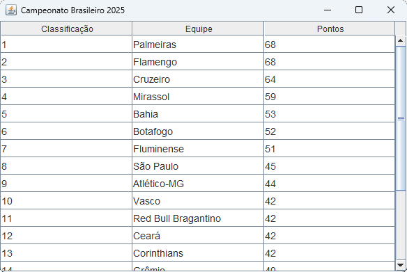
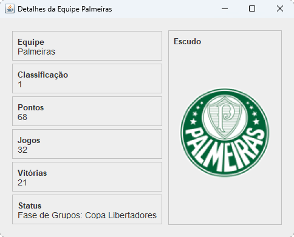

# **Projeto Cliente REST - Brasileirão**

Este projeto final faz parte da disciplina de Sistemas Distribuídos do curso de Ciência da Computação da Pontifícia Universidade Católica de Minas Gerais (PUC-MG) e tem por objetivo a criação de um software distribuído a partir da utilização de dados coletados por uma API.

O professor fez a recomendação do uso da plataforma [RapidAPI](https://rapidapi.com/) para a pesquisa e aquisição de alguma API, com o tema livre. Para este projeto, utilizarei a [FlashLive Sports](https://rapidapi.com/tipsters/api/flashlive-sports), um serviço que disponibiliza dados atualizados sobre esportes, e que contém dados do Campeonato Brasileiro de Futebol.

O objetivo do projeto é coletar os dados da API e mostrá-los ao usuário. Por esta API disponibilizar uma variedade grande de dados, achei interessante a criação de uma GUI que representasse a tabela de classificação do campeonato, com a possibilidade de ver detalhes sobre alguma equipe participante.

### *Tabela do Campeonato Brasileiro*

### *Detalhes sobre a equipe selecionada.*

## **Dados coletados:**

- **Nome da equipe**
- **Classificação**
- **Pontos acumulados**
- **Partidas Jogadas**
- **Quantidade de vitórias**
- **Escudo da equipe**
